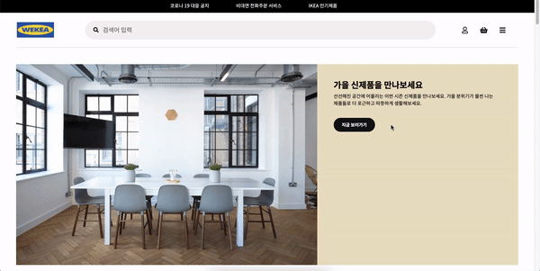

# wecode 1st project : Team WEKEA 🪑

> 가구 및 생활 소품 판매를 하는 다국적 기업인 [**IKEA**](https://www.ikea.com/kr/ko/) 를 클론 코딩한 **WEKEA** 팀 입니다!

 

 

---

 

## 소개

 

### 프로젝트 기간

- 21.10.05 (화) ~ 21.10.15 (금)

 

### 팀원 소개

 

#### FrontEnd

- 박산성
- 성해호
- 이상철
- 이나영

 

#### Backend

- 양가현
- 김주형

 

---

 

## 기술 스택

 

### FrontEnd

- `Javascript`, `React(CRA)`, `React-router-DOM`, `SCSS`

 

### Backend

- `Python`, `Django`, `MySQL`, `JWT`, `bcrypt`

 

### Communication

- `Slack`, `Zoom`, `Trello`, `Github`, `Git`

 

 

---

 

## 담당 부분 및 상세 내용

 

- 박산성 : 메인 페이지와 제품 목록 페이지 및 Common, Fix(공동 수정 내용) 브랜치 담당
  - 메인 페이지 및 제품 목록 페이지 레이아웃 구현
  - 메인 페이지
    - masonry 레이아웃 구현
    - preview 내 제품 정보 확인 기능(조건부 렌더링 활용)
  - 제품 목록 페이지
    - DB로부터 데이터를 수신하여 해당 카테고리 정보 반영 및 제품 리스트업
    - 특정 필터 조건에 따라 제품을 리스트업 하는 기능(필터링, `setState` 비동기 활용)
    - 리스트업 된 제품 클릭 시, 해당 제품 상세 페이지로 연결(동적 라우팅)

 

- 이나영 : 제품 상세 페이지 및 장바구니 페이지
  - 제품 상세 페이지 및 장바구니 페이지 레이아웃 구현
  - 제품 상세 페이지
    - 제품 이미지 클릭 시, 이미지 슬라이드 모달 창을 통해 확인할 수 있는 기능 구현
    - 각 제품 관련 정보를 모달 창을 통해 확인할 수 있는 기능
    - 제품 규격 선택 기능 구현
    - 추천 제품 리스트 버튼을 통한 슬라이드 기능 구현
    - 장바구니 페이지로의 조건부 링크 구현(토큰이 있을 경우)
  - 장바구니 페이지
    - 레이아웃 구현
    - 추천 제품 리스트 공동 컴포넌트로 활용

 

- 이상철 : 로그인 및 회원가입 페이지
  - 로그인 페이지 및 회원가입 페이지 레이아웃 구현
  - 로그인 페이지
    - 로그인 유효성 검사 기능 구현
    - input 타입 변경을 통한 비밀번호 보이기 기능 구현
    - DB와의 데이터 통신을 통해 유효한 계정과 비밀번호가 들어왔을 경우의 로그인 기능 구현
    - 로그인 후 토큰 생성 및 저장 구현
  - 회원가입 페이지
    - 회원가입 페이지 유효성 검사에 따른 불일치 화면과 버튼 활성화 기능 구현
    - DB와의 데이터 통신을 통해 회원가입 후 유저 정보를 DB에 저장하는 회원가입 기능 구현

 

- 성해호 : `nav` , `aside` 및 `footer` 등을 포함하는 공동 컴포넌트

- 공통 Nav, Side-bar, Footer UI 구현
- Nav, Side-bar
  - main 카테고리에 해당하는 sub-category 데이터를 DB로부터 수신하여 리스트 구현.
  - 조건부 렌더링을 이용해 2단 slide-bar 구현.
  - path parameter 이용해 페이지 간 이동 기능 구현
- Footer
  - 레이아웃 구현.

 

---

 

# Reference

- 이 프로젝트는 [**IKEA**](https://www.ikea.com/kr/ko/) 사이트를 참조하여 학습목적으로 만들었습니다.
- 실무수준의 프로젝트이지만 학습용으로 만들었기 때문에 이 코드를 활용하여 이득을 취하거나 무단 배포할 경우 법적으로 문제될 수 있습니다.
- 이 프로젝트에서 사용하고 있는 사진 대부분은 위코드에서 구매한 것이므로 해당 프로젝트 외부인이 사용할 수 없습니다.
